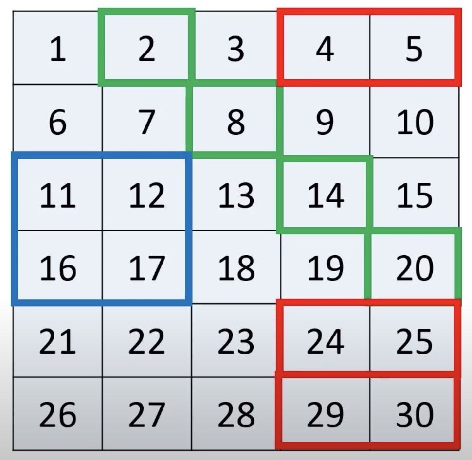

# Numpy Sample Code for Learning

## Reference

- <https://github.com/rougier/numpy-100/blob/master/100_Numpy_exercises.ipynb>
- <https://github.com/rougier/from-python-to-numpy>
- <https://github.com/ddbourgin/numpy-ml>
- <https://github.com/KeithGalli/NumPy> 

### What is NumPy?

[Chapter 1. Elegant NumPy](https://www.oreilly.com/library/view/elegant-scipy/9781491922927/ch01.html) of Elegant SciPy.

## Setup for Running

    # newer for poetry
    curl -sSL https://install.python-poetry.org | POETRY_VERSION=1.2.1 python3 -
    # install dependency
    poetry install
    poetry shell
    # install pre-commit and run checks
    pre-commit install
    pre-commit run -a
    # launch notebook
    jupyter notebook

## Quize

### Accessing specific elements

`np.info(np.arange)`

blue: `np.arange(1,31).reshape((6,5))[2:4,0:2]`

green: `np.arange(1,31).reshape((6,5))[[0,1,2,3],[1,2,3,4]]`

read: `np.arange(1,31).reshape((6,5))[[0,4,5],3:]`
